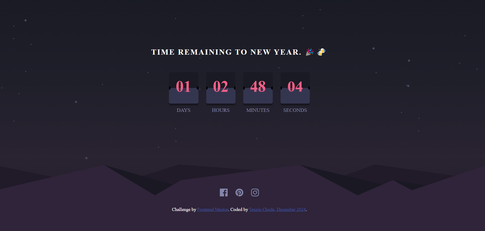

# Frontend Mentor - Launch countdown timer solution

This is a solution to the [Launch countdown timer challenge on Frontend Mentor](https://www.frontendmentor.io/challenges/launch-countdown-timer-N0XkGfyz-). Frontend Mentor challenges help you improve your coding skills by building realistic projects. 

*For fun I modified this solution to make a countdown timer for newyear(2025) while keeping the design and all similar to the original frontend mentor challenge.

## Table of contents

- [Overview](#overview)
  - [The challenge](#the-challenge)
  - [Screenshot](#screenshot)
  - [Links](#links)
- [My process](#my-process)
  - [Built with](#built-with)
  - [What I learned](#what-i-learned)
- [Author](#author)
- [Acknowledgments](#acknowledgments)

## Overview

### The challenge

Users should be able to:

- See hover states for all interactive elements on the page
- See a live countdown timer that ticks down every second (start the count at 14 days)
- **Bonus**: When a number changes, make the card flip from the middle

### Screenshot

### Links

- Solution URL: [Add solution URL here](https://www.frontendmentor.io/solutions/launch-down-timer-modified-to-new-year-count-down-bjTfC0V6Nv)
- Live Site URL: [https://newyear-countdown-timer-five.vercel.app/](https://newyear-countdown-timer-five.vercel.app/)

## My process
For this project I spend a few days thinking about ways to make the countdown timer work(count down), and making the cards flip. Once I had not the full solution but a starting point in my mind I started coding the design and the script to make the count down and also add the flipping effect to the cards.

### Built with

- I have just used the HTML, CSS and Javascript to build this project.

### What I learned

Like I do from all the other frontend mentor challenges, I learned a lot form this challenge too.
- After doing this challenge, I have got a better understanding of the Javascript `Date object`. I had to spend some time reading about the date object on MDN web docs.
- This challenge has also helped me refresh my knowledge of CSS animations. It was interesting making the cards flip with CSS animation and some scripts. 

## Author

- Frontend Mentor - [@tenze21](https://www.frontendmentor.io/profile/tenze21)
- linkedin - [@tenzin-choda](https://www.linkedin.com/in/tenzin-choda-8497b8307?utm_source=share&utm_campaign=share_via&utm_content=profile&utm_medium)

## Acknowledgments

**Thanks to [**Frontend Mentor**](https://www.frontendmentor.io) for this interesting challenge.**
